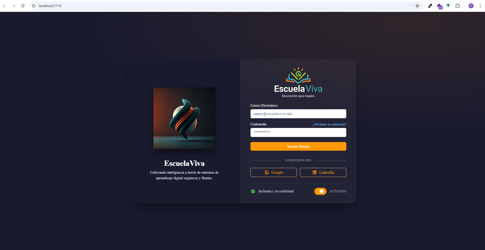

# 📘 EscuelaViva
## *Educación que inspira*

**EscuelaViva** es una plataforma educativa integral, diseñada para cerrar brechas estructurales en el acceso, calidad, inclusión y gestión educativa en América Latina. Combina personalización, colaboración, datos accionables y una fuerte comunidad escolar, convirtiéndose en un ecosistema educativo vivo para docentes, estudiantes, apoderados, PIE y directivos.

---

## 🚀 Visión
Crear un ecosistema educativo verdaderamente inclusivo, colaborativo y accesible, donde la tecnología empodere a los actores educativos, no los reemplace.

## 🎯 Misión
Empoderar a las comunidades educativas mediante una plataforma que:
- Personalice el aprendizaje con IA ética y DUA.
- Fortalezca la colaboración entre todos los actores.
- Simplifique la gestión docente y administrativa.
- Garantice inclusión real para estudiantes con NEE.
- Funcione sin conexión, llegando a zonas rurales.

---

## 🛠️ Arquitectura Técnica

### Frontend
- **Framework**: Vue 3 + Vite
- **UI**: PrimeVue + Tailwind CSS
- **Estado**: Pinia
- **PWA**: Vite Plugin + Workbox (modo offline)

### Backend
- **Framework**: NestJS (Node.js + TypeScript)
- **API**: GraphQL (Apollo Server)
- **Base de Datos**: PostgreSQL + Prisma ORM

### Infraestructura
- **Frontend Hosting**: Vercel / Netlify
- **Backend Hosting**: Railway / Render
- **Multiplataforma**: Capacitor (iOS/Android) + Electron (Escritorio)

---

## ⚖️ Licencia

Este proyecto está bajo una licencia personalizada de **«Uso para Evaluación»**. Consulta los detalles [aquí](LICENSE).

---

**EscuelaViva SpA** – Todos los derechos reservados.
